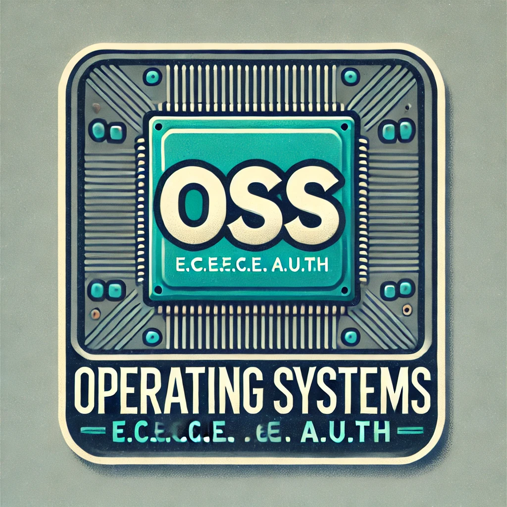

# OSS Course Notes
 

> Logo designed by AI: DALLE. Slightly off, but good in general.

## Contents
This repo was created for the Operating Systems course, as taught by Prof [Nikos
Pitsianis](https://ece.auth.gr/staff/nikolaos-pitsianis-2/). In it we were
tasked with creating a series of small scripts to indicate experience in simple
system administration tasks and understanding of the underlying principles.

## Disclaimer
This repo is incomplete and I intend to revisit it in the future. There are some
missing exercises
